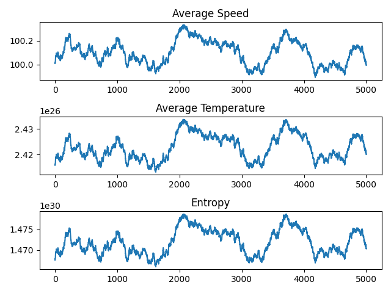
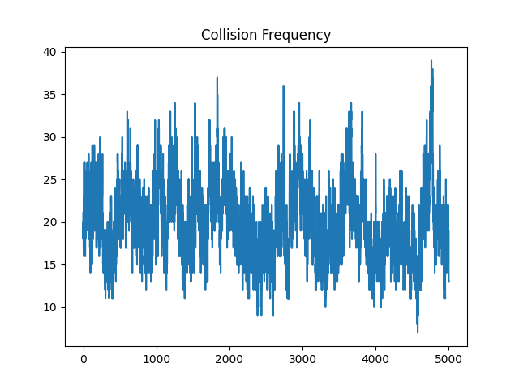

# Particle Simulation and Entropy Calculation <!-- omit in toc -->

## Overview <!-- omit in toc -->

This project simulates the behavior of particles in a two-dimensional box. The simulation considers various physical properties and interactions, including entropy, temperature, and collisions. The primary goal is to study the evolution of these properties over time.

Click [here](#results) to see the results of the simulation.

## Table of Contents <!-- omit in toc -->

- [Installation](#installation)
- [Usage](#usage)
- [Physics Considerations](#physics-considerations)
  - [Entropy](#entropy)
  - [Temperature](#temperature)
  - [Thermodynamics and Statistical Mechanics](#thermodynamics-and-statistical-mechanics)
  - [Collisions](#collisions)
  - [Energy Dissipation](#energy-dissipation)
- [Simulation Parameters](#simulation-parameters)
- [Example](#example)
- [Output](#output)
- [Results](#results)
- [Conclusion](#conclusion)
- [Note](#note)
- [License](#license)
- [Contact](#contact)

## Installation

To run this project, you need to have Python installed along with the following libraries:

- NumPy
- Matplotlib

You can install the required libraries using pip:

```sh
pip install numpy matplotlib
```

or you can use the provided `requirements.txt` file:

```sh
pip install -r requirements.txt
```

## Usage

To run the simulation, execute the simulation.py script:

```sh
python run.py
```

Parameters such as the number of particles, box size, initial temperature, dissipation constant, and simulation time can be adjusted in the script.

## Physics Considerations

### Entropy

Entropy is a measure of the disorder or randomness in a system. In this simulation, we calculate the entropy from the kinetic energy of the particles:

$$ Kinetics Energy (E*k) = \sum*{i=1}^{N} \frac{1}{2} m v_i^2 $$

$$ Entropy = \frac{1}{2} k_B \log\left(\frac{2\pi e m}{h^2}\right) + \frac{3}{2} k_B \log\left(\frac{E_k}{N}\right) $$

### Temperature

Temperature is a measure of the average kinetic energy of the particles in a system. In the context of our simulation, each particle has its own kinetic energy, which is calculated as:

$$
`
E_k = \frac{1}{2} m v^2
`
$$

where \( m \) is the mass of the particle and \( v \) is its velocity. The temperature \( T \) of the system can be derived from the average kinetic energy of the particles using the relation:

$$
`
T = \frac{2}{3k_B} \left\langle E_k \right\rangle
`
$$

where \( k_B \) is the Boltzmann constant and \( \left\langle E_k \right\rangle \) is the average kinetic energy of the particles. In the code, this is implemented in the `update_kinetic_energy_and_temperature` method of the `Particle` class:

```python
def update_kinetic_energy_and_temperature(self):
    self.kinetic_energy = 0.5 * self.mass * np.linalg.norm(self.velocity)**2
    self.temperature = self.kinetic_energy / (1.5 * 1.38e-23)  # Boltzmann constant
```

### Thermodynamics and Statistical Mechanics

Thermodynamics and statistical mechanics provide the theoretical framework for understanding the macroscopic properties of systems from the microscopic behavior of their constituents. In our simulation, we consider several key principles from these fields:

1. **Kinetic Theory of Gases**:
   The kinetic theory relates the macroscopic properties of gases, such as pressure and temperature, to the microscopic motion of particles. The pressure \( P \) of an ideal gas is given by:

   $`
   P = \frac{N k_B T}{V}
   `$

   where \( N \) is the number of particles, \( T \) is the temperature, and \( V \) is the volume of the container.

2. **Boltzmann Distribution**:
   The velocities of particles in a system at thermal equilibrium follow the Maxwell-Boltzmann distribution. The probability \( P(v) \) of finding a particle with velocity \( v \) is:

   $`
   P(v) = \left( \frac{m}{2 \pi k_B T} \right)^{3/2} \exp\left( -\frac{m v^2}{2 k_B T} \right)
   `$

3. **Equipartition Theorem**:
   The equipartition theorem states that each degree of freedom contributes \( \frac{1}{2} k_B T \) to the total energy. For a system with \( f \) degrees of freedom, the total kinetic energy \( E \) is:

   $`
   E = \frac{f}{2} N k_B T
   `$
In the simulation, we initialize the particles with velocities that follow a random distribution, and their interactions lead to a distribution that approximates the Maxwell-Boltzmann distribution over time. The `calculate_properties` function computes the average speed, temperature, and entropy of the system:

```python
def calculate_properties(particles):
    avg_speed = np.mean([np.linalg.norm(p.velocity) for p in particles])
    avg_temperature = np.mean([p.temperature for p in particles])
    entropy = np.sum([p.temperature * np.log(p.temperature) for p in particles])
    return avg_speed, avg_temperature, entropy
```

These calculations allow us to study the evolution of the system's macroscopic properties and validate the principles of thermodynamics and statistical mechanics.

### Collisions

Collisions between particles are handled using elastic collision principles. When two particles collide, their velocities are updated based on the conservation of momentum and energy. The steps to calculate the collisions are as follows:

1. **Distance Calculation**:
   We first calculate the distance between each pair of particles to check if they are colliding. A collision is detected if the distance between the centers of two particles is less than twice the particle radius:

   $`
   \text{dist} = \sqrt{(x_i - x_j)^2 + (y_i - y_j)^2}
   `$

   where $(x_i, y_i)$ and $(x_j, y_j)$ are the positions of particles $i$ and $j$, respectively.

2. **Collision Angle**:
   If a collision is detected, we calculate the collision angle $\theta$ using the arctangent of the difference in positions:

   $`
   \theta = \arctan2(y_i - y_j, x_i - x_j)
   `$

3. **Velocity Rotation**:
   We rotate the velocities of the colliding particles to the collision frame. This simplifies the calculations by aligning the collision axis with one of the coordinate axes. The rotation matrix $R$ is given by:

   $`
   R = \begin{bmatrix}
   \cos(\theta) & -\sin(\theta) \\
   \sin(\theta) & \cos(\theta)
   \end{bmatrix}
   `$

   The rotated velocities $\mathbf{v}_i'$ and $\mathbf{v}_j'$ are obtained by:

   $`
   \mathbf{v}_i' = R \mathbf{v}_i
   `$
   $`
   \mathbf{v}_j' = R \mathbf{v}_j
   `$

4. **Elastic Collision in 1D**:
   In the collision frame, we perform an elastic collision calculation in one dimension. The new velocities after the collision are:

   $`
   v_{i,x}' = v_{j,x}'
   `$
   $`
   v_{j,x}' = v_{i,x}'
   `$

   where $v_{i,x}'$ and $v_{j,x}'$ are the x-components of the rotated velocities.

5. **Velocity Rotation Back**:
   We rotate the velocities back to the original frame using the inverse of the rotation matrix:

   $`
   \mathbf{v}_i = R^{-1} \mathbf{v}_i'
   `$
   $`
   \mathbf{v}_j = R^{-1} \mathbf{v}_j'
   `$

6. **Energy Dissipation**:
   To account for non-ideal collisions, we introduce a dissipation constant $\gamma$. The energy dissipated during the collision is:

   $`
   E_{\text{dissipated}} = \frac{1}{2} \gamma (v_{i,x}'^2 + v_{i,y}'^2 + v_{j,x}'^2 + v_{j,y}'^2)
   `$

   The velocities are then adjusted to reflect the energy loss:

   $`
   \mathbf{v}_i = (1 - \gamma) \mathbf{v}_i
   `$
   $`
   \mathbf{v}_j = (1 - \gamma) \mathbf{v}_j
   `$

7. **Thermal Velocity Adjustment**:
   Finally, we adjust the velocities based on the environmental temperature to simulate thermal effects. The thermal velocity $v_{\text{thermal}}$ is given by:

   $`
   v_{\text{thermal}} = \sqrt{\frac{k_B T}{m}}
   `$

   where $k_B$ is the Boltzmann constant, $T$ is the temperature, and $m$ is the mass of a particle. The velocities are adjusted by adding a random component:

   $`
   \mathbf{v}_i += \mathcal{N}(0, v_{\text{thermal}} \gamma)
   `$
   $`
   \mathbf{v}_j += \mathcal{N}(0, v_{\text{thermal}} \gamma)
   `$

   where $\mathcal{N}(0, \sigma)$ represents a normal distribution with mean 0 and standard deviation $\sigma$.

### Energy Dissipation

Energy dissipation is considered in the simulation to account for non-ideal collisions where some energy is lost. The dissipation constant determines the fraction of energy lost during each collision.

## Simulation Parameters

The simulation parameters can be adjusted in the `run.py` script. Here are the key parameters that can be modified:

<!-- n, box_size, steps, initial_speed, particle_radius -->

- `n`: The number of particles in the simulation.
- `box_size`: The size of the square box in which the particles are confined.
- `steps`: The number of simulation steps to run.
- `initial_speed`: The initial speed of the particles.
- `particle_radius`: The radius of the particles.

## Example

Here is an example of how to create and run a simulation:

```python
from calc import run_simulation
n = 100  # Number of particles
box_size = 10  # Size of the box
steps = 1000  # Number of simulation steps
initial_speed = 1  # Initial speed of the particles
particle_radius = 0.1  # Radius of the particles
run_simulation(n, box_size, steps, initial_speed, particle_radius)
```

## Output

The simulation generates a an animation of the particle motion, a plot of the average speed, temperature, and entropy over time, and a plot of collisions.

- `particles_simulation.mp4`: An animation showing the motion of the particles in the box.
- `average_speed_temperature_entropy.png`: A plot showing the average speed, temperature, and entropy of the system over time.
- `collision_frequency.png`: A plot showing the number of collisions that occur in each time step.

## Results

Below is a sample output of the simulation:

**Particle Simulation:**


**Average Speed, Temperature, and Entropy:**



**Collision Frequency:**



## Conclusion

This project provides a detailed simulation of particle behavior in a confined space, considering various physical properties and interactions. It serves as a useful tool for studying the dynamics of particle systems and the evolution of entropy and temperature over time.

## Note

_Currently the model has not been fully quantized. Although the model is based on the principles of statistical mechanics and thermodynamics, the simulation is not a direct representation of a real-world system. The model can be further refined by considering additional factors such as intermolecular forces, particle interactions, and external fields._

## License

This project is licensed under the MIT License - see the [LICENSE](LICENSE) file for details.

## Contact

For any questions or suggestions, feel free to contact me at [me@ericxin.eu](mailto:me@ericxin.eu).
