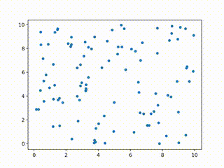
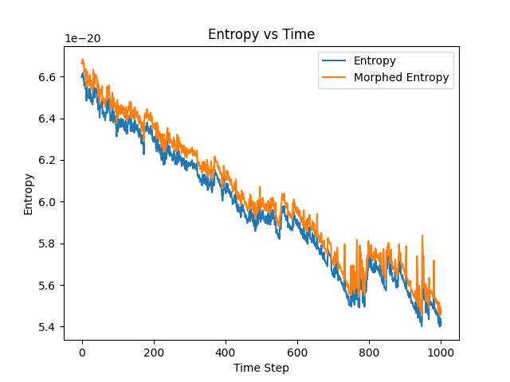
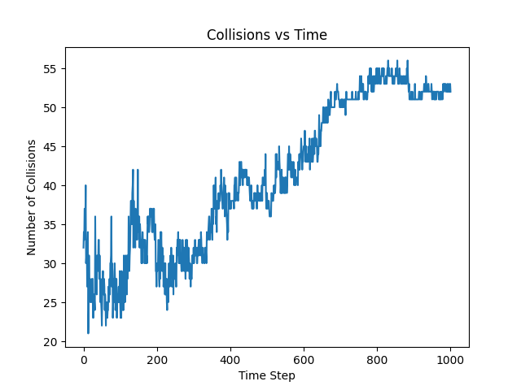
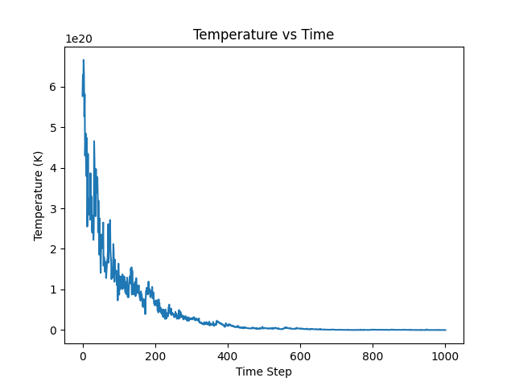

# Particle Simulation and Entropy Calculation <!-- omit in toc -->

## Overview <!-- omit in toc -->

This project simulates the behavior of particles in a two-dimensional box. The simulation considers various physical properties and interactions, including entropy, temperature, and collisions. The primary goal is to study the evolution of these properties over time.

## Table of Contents <!-- omit in toc -->

- [Installation](#installation)
- [Usage](#usage)
- [Physics Considerations](#physics-considerations)
  - [Entropy](#entropy)
  - [Temperature](#temperature)
  - [Collisions](#collisions)
  - [Energy Dissipation](#energy-dissipation)
- [Simulation Details](#simulation-details)
- [Example](#example)
- [Output](#output)
- [Results](#results)
- [Conclusion](#conclusion)
- [License](#license)
- [Notes](#notes)
- [Contact](#contact)

## Installation

To run this project, you need to have Python installed along with the following libraries:

- NumPy
- Matplotlib

You can install the required libraries using pip:

```sh
pip install numpy matplotlib
```

or you can use the provided `requirements.txt` file:

```sh
pip install -r requirements.txt
```

## Usage

To run the simulation, execute the simulation.py script:

```sh
python simulation.py
```

Parameters such as the number of particles, box size, initial temperature, dissipation constant, and simulation time can be adjusted in the script.

## Physics Considerations

### Entropy

Entropy is a measure of the disorder or randomness in a system. In this simulation, we calculate the entropy using the Boltzmann formula:

$$ S = k_B \ln W $$

where:

- $S$ is the entropy,
- $k_B$ is the Boltzmann constant,
- $W$ is the number of microstates.

### Temperature

Temperature is a measure of the average kinetic energy of the particles. We calculate the temperature based on the velocities of the particles:

$$ T = \frac{2}{3Nk*B} \sum*{i=1}^{N} \frac{1}{2} m v_i^2 $$

where:

- $T$ is the temperature,
- $N$ is the number of particles,
- $k_B$ is the Boltzmann constant,
- $m$ is the mass of a particle,
- $v_i$ is the velocity of particle $i$.

### Collisions

Collisions between particles are handled using elastic collision principles. When two particles collide, their velocities are updated based on the conservation of momentum and energy. The steps to calculate the collisions are as follows:

1. **Distance Calculation**:
   We first calculate the distance between each pair of particles to check if they are colliding. A collision is detected if the distance between the centers of two particles is less than twice the particle radius:

   $`
   \text{dist} = \sqrt{(x_i - x_j)^2 + (y_i - y_j)^2}
   `$

   where $(x_i, y_i)$ and $(x_j, y_j)$ are the positions of particles $i$ and $j$, respectively.

2. **Collision Angle**:
   If a collision is detected, we calculate the collision angle $\theta$ using the arctangent of the difference in positions:

   $`
   \theta = \arctan2(y_i - y_j, x_i - x_j)
   `$

3. **Velocity Rotation**:
   We rotate the velocities of the colliding particles to the collision frame. This simplifies the calculations by aligning the collision axis with one of the coordinate axes. The rotation matrix $R$ is given by:

   $`
   R = \begin{bmatrix}
   \cos(\theta) & -\sin(\theta) \\
   \sin(\theta) & \cos(\theta)
   \end{bmatrix}
   `$

   The rotated velocities $\mathbf{v}_i'$ and $\mathbf{v}_j'$ are obtained by:

   $`
   \mathbf{v}_i' = R \mathbf{v}_i
   `$
   $`
   \mathbf{v}_j' = R \mathbf{v}_j
   `$

4. **Elastic Collision in 1D**:
   In the collision frame, we perform an elastic collision calculation in one dimension. The new velocities after the collision are:

   $`
   v_{i,x}' = v_{j,x}'
   `$
   $`
   v_{j,x}' = v_{i,x}'
   `$

   where $v_{i,x}'$ and $v_{j,x}'$ are the x-components of the rotated velocities.

5. **Velocity Rotation Back**:
   We rotate the velocities back to the original frame using the inverse of the rotation matrix:

   $`
   \mathbf{v}_i = R^{-1} \mathbf{v}_i'
   `$
   $`
   \mathbf{v}_j = R^{-1} \mathbf{v}_j'
   `$

6. **Energy Dissipation**:
   To account for non-ideal collisions, we introduce a dissipation constant $\gamma$. The energy dissipated during the collision is:

   $`
   E_{\text{dissipated}} = \frac{1}{2} \gamma (v_{i,x}'^2 + v_{i,y}'^2 + v_{j,x}'^2 + v_{j,y}'^2)
   `$

   The velocities are then adjusted to reflect the energy loss:

   $`
   \mathbf{v}_i = (1 - \gamma) \mathbf{v}_i
   `$
   $`
   \mathbf{v}_j = (1 - \gamma) \mathbf{v}_j
   `$

7. **Thermal Velocity Adjustment**:
   Finally, we adjust the velocities based on the environmental temperature to simulate thermal effects. The thermal velocity $v_{\text{thermal}}$ is given by:

   $`
   v_{\text{thermal}} = \sqrt{\frac{k_B T}{m}}
   `$

   where $k_B$ is the Boltzmann constant, $T$ is the temperature, and $m$ is the mass of a particle. The velocities are adjusted by adding a random component:

   $`
   \mathbf{v}_i += \mathcal{N}(0, v_{\text{thermal}} \gamma)
   `$
   $`
   \mathbf{v}_j += \mathcal{N}(0, v_{\text{thermal}} \gamma)
   `$

   where $\mathcal{N}(0, \sigma)$ represents a normal distribution with mean 0 and standard deviation $\sigma$.

### Energy Dissipation

Energy dissipation is considered in the simulation to account for non-ideal collisions where some energy is lost. The dissipation constant determines the fraction of energy lost during each collision.

## Simulation Details

The ParticleSimulation class in entropy_calc.py handles the core simulation logic. Key methods include:

- `__init__`: Initializes the simulation parameters and particle states.
- `update_positions`: Updates the positions of the particles based on their velocities.
- `handle_collisions`: Handles collisions between particles and updates their velocities.
- `calculate_entropy`: Calculates the entropy of the system.
- `update_temperature`: Updates the temperature based on dissipated energy.
- `animate`: Updates the animation frame by frame.
- `run_simulation`: Runs the simulation for a specified number of steps and generates plots for entropy, temperature, and collisions.

## Example

Here is an example of how to create and run a simulation:

```python
from utils import ParticleSimulation

# Create a simulation instance
sim = ParticleSimulation(N=100, box_size=10, initial_temperature=300)

# Run the simulation
sim.run_simulation(num_steps=100, dt=0.1)
```

## Output

The simulation generates the following outputs:

- `particle_simulation.mp4`: An animation of the particle movements.
- `entropy_curve.png`: A plot of entropy vs. time.
- `temperature_curve.png`: A plot of temperature vs. time.
- `collision_curve.png`: A plot of the number of collisions vs. time.

## Results

This sample result is generated with the following parameters:

- Number of particles: 100
- Box size: 100
- Initial temperature: 10 K
- Dissipation constant: 0.1
- Simulation time: 1000 steps
- Time step: 0.1
- Thermal velocity factor: 0.1
- Collision radius: 1
- Particle radius: 0.5

The simulation video is attached below:



The entropy, temperature, and collision plots are shown below:







## Conclusion

This project provides a detailed simulation of particle behavior in a confined space, considering various physical properties and interactions. It serves as a useful tool for studying the dynamics of particle systems and the evolution of entropy and temperature over time.

## License

This project is licensed under the MIT License - see the [LICENSE](LICENSE) file for details.

## Notes

This project is currently in the developmental phase. Preliminary results indicate a decrease in entropy, contrary to theoretical expectations. Challenges remain in accurately updating the system's temperature and entropy, as well as in evaluating the microstates. Ongoing efforts are focused on refining these aspects. Contributions and suggestions are welcome.

## Contact

For any questions or suggestions, feel free to contact me at [me@ericxin.eu](mailto:me@ericxin.eu).
